# 1. OpenShift4クラスターの構築
OpenShift4をAWS上にインストールする際には，Red Hat Customer Portalアカウントの取得とAWSアカウントの設定が必要です。  
以下をハンズオンの中で準備し，最後にOpenShift4のインストールを行います。  
- Red Hat Customer Portalのアカウントの準備
- AWSアカウントの準備
    - AWS IAMユーザーの作成と権限，認証情報の確認
    - AWS Route53サービスの作成
    - AWSリソースの制限緩和
    - AWS CLIのセットアップ
- OpenShift4のインストール
    - インストーラー(openshift-install)取得
    - install-config.yaml作成
    - インストール

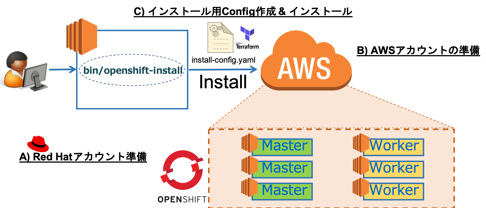


## 1-1. 諸注意
### 1-1-1. OpenShift4のインストールについて
OpenShift4は，IPIによるインストール，UPIによるインストールの2つの方法があります。詳しくは[公式ドキュメント](https://access.redhat.com/documentation/ja-jp/openshift_container_platform/4.1/html/installing/index)を参照ください。

- IPI (Installer-Provisioned Infrastructure)
    - デフォルト設定を使用してOpenShift4インストーラーがインフラ環境を準備してインストールする方法
    - 対応クラウドプロバイダー
        - AWS
        - Azure
- UPI (User-Provisioned Infrastructure)
    - ユーザー独自に準備したインフラ環境にインストールする方法
    - 対応プラットフォーム
        - AWS (CloudFormationテンプレート利用)
        - vSphere
        - ベアメタル

### 1-1-2. 事前準備
なし

### 1-2. Red Hatアカウント Customer Portalアカウントの準備
OpenShift4のインストールに必要なクレデンシャル情報などを取得するために必要です。  
[Red Hatページ](https://cloud.redhat.com/)にアクセスし，[Log in your Red Hat account] > [Red Hat アカウントをお持ちでないお客様] からいくつかの項目を入力し，アカウントを作成します。  

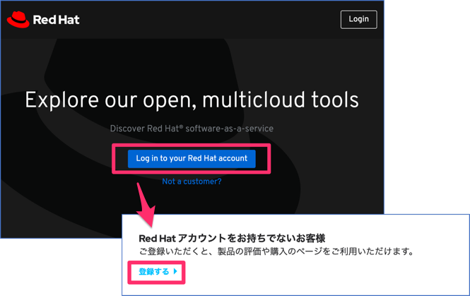

図: Red Hat Customer Portal アカウントの作成

## 1-3. AWSアカウントの準備
### 1-3-1. AWSアカウントの作成
OpenShift4をインストールする際に必要なEC2やロードバランサーなどのAWSリソースを利用するために必要です。AWSページ(https://aws.amazon.com/jp/)にアクセスして作成しましょう。

### 1-3-2. AWS IAMユーザーの作成と権限，認証情報の確認
インストール作業を行うユーザー用にIAMユーザーを作成します。作成時に適切な権限(“Programmatic access” のアクセス権限と，“AdministratorAccess” のポリシー)を付与しましょう。なお，IAMユーザーの作成は必須ではありませんが，AWSアカウントにはアカウント作成に使用したメールアドレスに基づくrootユーザーアカウントが含まれており，高い権限が含まれています。このため，初期アカウントおよび請求設定のみに使用することが推奨されています。

参考までに以下にて，IAMユーザーの作成および権限付与について手順を記載しますが，基本的にはAWS公式ドキュメントに従ってユーザー作成などの操作を行ってください。

- IAMユーザーの作成と権限付与の手順
    1. IAMページ(https://console.aws.amazon.com/iam/)を開き，[ユーザー]>[ユーザーを追加]を開きます。ユーザー名に任意の名前(図例では “capsmalt-aws”)を指定し，「プログラムによるアクセス」，「AWSマネジメントコンソールへのアクセス」にチェックを入れ，[次のステップ:アクセス権限]に進みます。
    2. [既存のポリシーを直接アタッチ]を開き，「AdministratorAccess」にチェックを入れて，[次のステップ:タグ]に進みます。
    3. デフォルト値のままで，[次のステップ:確認]に進みます。
    4. デフォルト値のままで，[ユーザーの作成]と進みます。

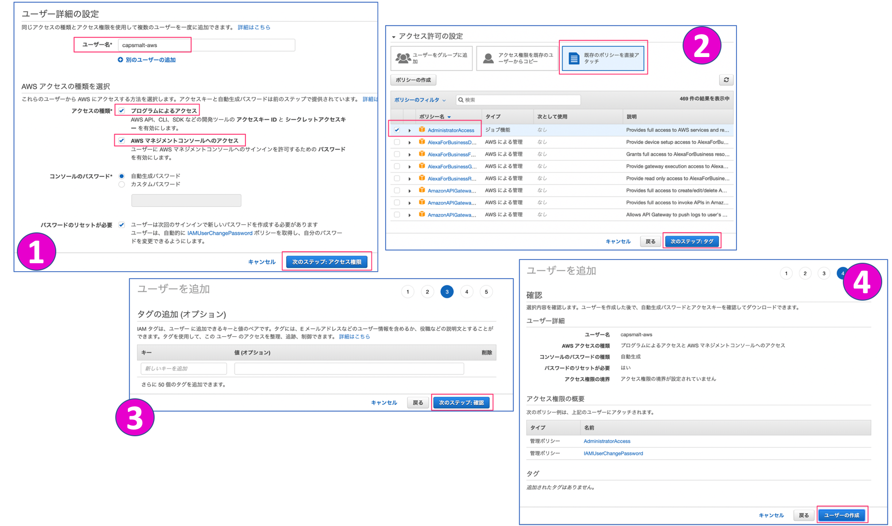

図: AWS IAMユーザーの作成と権限設定


以上の操作でIAMユーザーが作成され，“AWS IAMユーザー認証情報” が表示されます。

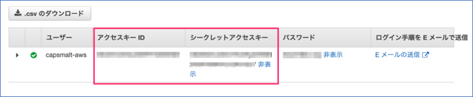

図: AWS IAMユーザー認証情報

“アクセスキーID”，”シークレットアクセスキー” はAWS CLI(後述)からAWSリソースを制御するために必要になりますので，忘れずにメモしておきましょう。「.csvのダウンロード」を選択して認証情報をローカルに保存しておくと便利です。

(参考) [OpenShift4インストールに必要なパーミッション](https://access.redhat.com/documentation/ja-jp/openshift_container_platform/4.1/html/installing/installing-on-aws#installation-aws-permissions_installing-aws-account)

### 1-3-3. AWS Route53のサービスの作成
OpenShift4クラスターに外部から接続するために必要です。既に利用可能なドメインがあれば新規に取得する必要はありません。取得したドメインは，2-2節でOpenShift4インストーラーを実行する際に指定しますのでメモしておきましょう。(本章の説明では， “capsmalt.net”)

- Route 53でドメイン登録
    1. AWSにログインし，[サービス]>[Route 53]>[ドメインの登録-今すぐ始める]>[ドメインの登録]を開きます。
    2. 任意のドメイン名を決めて，[チェック]>[カートに入れる]>[続行]と進めて，決済など契約手続きを行います。
    3. ドメインの自動更新の[無効化]を選択し，規約を確認してチェックを入れます。また登録者のメールアドレスに送られる通知の確認も行います。最後に[購入の完了]を選択します。
    4. ドメイン登録のステータスが進行中から成功に変わるのを待ちましょう。(30分程度かかりました)

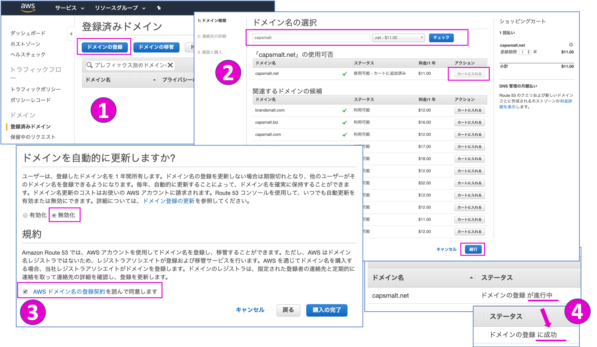

図: Route 53サービスでドメイン登録

(参考) [Route 53サービス](https://console.aws.amazon.com/route53/)

### 1-3-4. AWSリソースの制限緩和 (デフォルト構成の場合は不要)
AWSアカウント作成直後の状態ではリソース利用量に対して制限がかかっているため，制限緩和の作業が必要になる場合があります。OpenShift4をインストールするために必要なリソースは “OpenShift Limits Calculator” で確認できます。2019年8月16日時点では，AWSアカウントの初期状態でもOpenShift4をデフォルト構成でインストール可能です。一方で，カスタマイズ構成でクラスター構築する場合や，複数クラスターを構築するなど，多量のリソースが必要になる場合は事前にAWSサポート窓口経由で制限緩和リクエスト挙げる必要があります。


(参考) [OpenShift4のインストールおよび実行に影響を与えうるAWSリソース制限](https://access.redhat.com/documentation/ja-jp/openshift_container_platform/4.1/html/installing/installing-on-aws#installation-aws-limits_installing-aws-account)
(参考) [OpenShift Limits Calculator](https://access.redhat.com/labs/ocplimitscalculator/)
(参考) [AWS東京リージョンの制限](https://ap-northeast-1.console.aws.amazon.com/ec2/v2/home?region=ap-northeast-1#Limits:)
(参考) [AWS制限緩和のリクエストページ](https://console.aws.amazon.com/support/cases?#/create?issueType=service-limit-increase)

### 1-3-5. AWS CLIのセットアップ
OpenShift4インストーラー(2-2節にて後述)がAWSアカウントの認証情報を使用するために構成しておく必要があります。`$ aws configure`を実行して，2-1-3で取得したアクセスキーID，シークレットアクセスキーを指定します。またリージョン(東京の場合は ap-northeast-1)も指定しましょう。

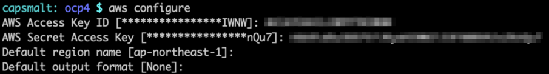

図: AWSアカウントの認証情報の構成(CLI)

## 1-4. OpenShift4のインストール
### 1-4-1. インストーラー取得とクレデンシャルの準備
最初にIPIインストールを実行するためのインストーラーと，クレデンシャル情報を用意します。Red Hat Customer Portalアカウントにログインし，[AWSへのIPIインストール](https://cloud.redhat.com/openshift/install/aws/installer-provisioned)から取得します。

OpenShift4インストーラー(openshift-installコマンド) は，OpenShift4をIPIという方法でインストールする際に必要です。インストール操作を行うクライアントOS(linux or mac)に合わせたインストーラーを取得します。

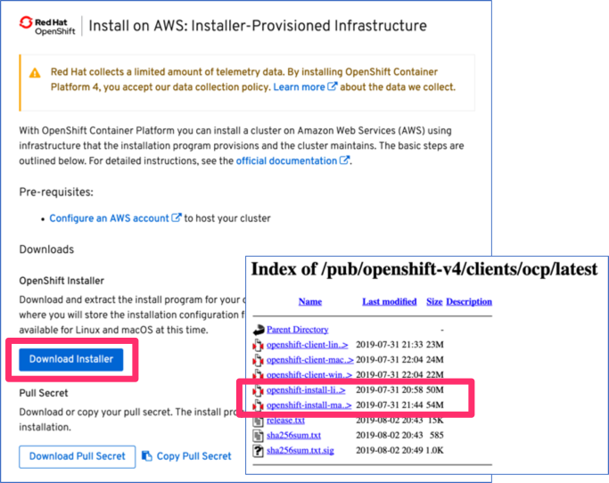

図: OpenShift4インストーラー (linux or mac)

以下のように実行して展開し，openshift-installコマンドを実行できるようにしておきます。  
$ tar xzf openshift-install-mac-4.1.9.tar.gz 


クレデンシャル情報(Pull-Secret) は，OpenShiftクラスターを管理する際に使用されるためRed Hat アカウント毎に異なります。openshift-installコマンドを実行した際に入力します。


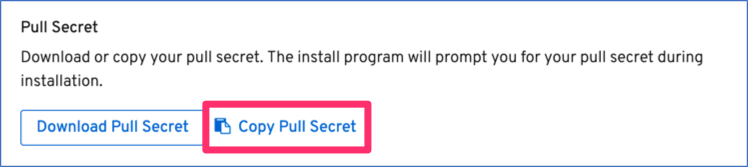

図: クレデンシャル情報(Pull-Secret)

### 1-4-2. インストール用Configファイルの作成 (install-config.yaml)
必要な情報は揃いましたので，図の実行例を参考にOpenShift4をAWS上にインストールしてみましょう。  
まずはインストールに使用する構成情報(install-config.yaml)を作成します。  

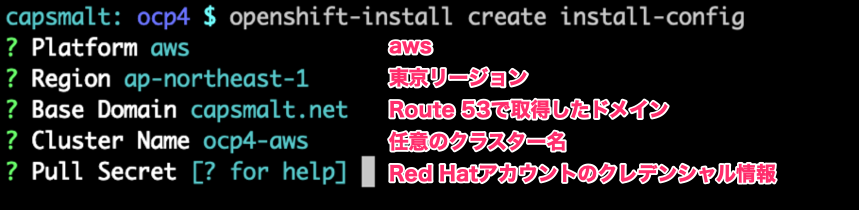

図: openshift-install create install-config 実行イメージ

上記を実行した際に作成されるinstall-config.yamlは以下です。
```
apiVersion: v1
baseDomain: capsmalt.net
compute:
- hyperthreading: Enabled
  name: worker
  platform: {}
  replicas: 3
controlPlane:
  hyperthreading: Enabled
  name: master
  platform: {}
  replicas: 3
metadata:
  creationTimestamp: null
  name: ocp4-aws
networking:
  clusterNetwork:
  - cidr: 10.128.0.0/14
    hostPrefix: 23
  machineCIDR: 10.0.0.0/16
  networkType: OpenShiftSDN
  serviceNetwork:
  - 172.30.0.0/16
platform:
  aws:
    region: ap-northeast-1
pullSecret: '{"auths":{"cloud.openshift.com":{"auth":"XXX","email":"capsmalt@gmail.com"},"quay.io":{"auth":"XXX","email":"capsmalt@gmail.com"},"registry.connect.redhat.com":{"auth":"XXX","email":"capsmalt@gmail.com"},"registry.redhat.io":{"auth":"XXX","email":"capsmalt@gmail.com"}}}'


```

OpenShift4を構築するコマンドを実行した際にinstall-config.yamlは，自動削除されてしまいますのでバックアップを取っておきましょう。(例: `$ cp -p install-config.yaml{,.org}`)

### 1-4-3. OpenShift4クラスターのインストール
AWS上にOpenShift4を構築するコマンド(`$ openshift-install create cluster`)を実行します。  
クラスター構築完了までに3-40分ほどかかります。

>コマンド実行後インストールログ(.openshift_install.log)がコマンド実行ディレクトリに生成されるので，tail(`$ tail -f .openshift_install.log`)などでログを追ってみるのも良いかもしれません。

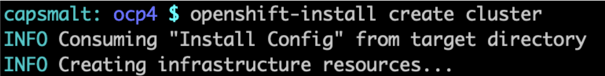

図: $ openshift-install create cluster 実行イメージ

以下のような文字列(URLおよびログイン情報)の出力が確認できればクラスター構築は完了です。
- Kubernetes API (Master): https://api.ocp4-aws.capsmalt.net:6443
- Console: https://console-openshift-console.apps.ocp4-aws.k8show.net
- ログインユーザー: kubeadmin
- ログインパスワード: Nmp83-XXXXX-XXXXX-YHtst

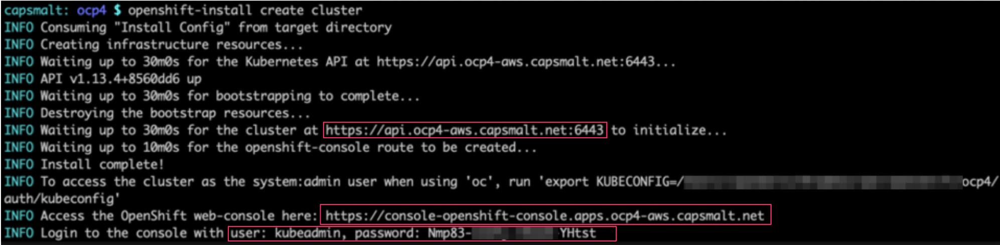

図: クラスター構築完了時点の出力イメージ

インストールに失敗した場合は，「Tips: OpenShift4インストールに失敗した場合の前処理」を参照ください。AWSリソース不足では無い場合は，何度か繰り返しトライしてみてください。  
>AWSアカウントを作成した直後の状態では，リージョンやリソースの準備ができていないせいか，うまくクラスター作成できない場合があります。あくまで経験上の話にはなりますが，作成したばかりのAWSアカウントの場合は，2,3回トライするとクラスター作成が無事成功するようになりました。

### Tips: OpenShift4インストールに失敗した場合の前処理
OpenShift4のインストールに失敗し，エラー末尾に以下のようなメッセージが出力される場合があります。
```
"failed to fetch Cluster: failed to generate asset \"Cluster\": failed to create cluster: failed to apply using Terraform"
```
例えば，AWSの指定リージョンの準備が出来ていない場合や，AWSリソースの制限にかかるケースなどいくつかのパターンが考えられます。  
この場合，エラーメッセージを参考に対処した上で再インストールの作業が必要です。再インストールする際は，以下を忘れずに実施しましょう。
```
$ openshift-install destroy cluster                      # AWS上のOpenShift4関連のリソースを削除
$ rm terraform.tfstate 		                             # Terraformのstateファイルの削除
$ cp install-config.yaml.org install-config.yaml         # OpenShift4構成ファイルのコピー
上記を実行後に，再度インストールコマンドを実行
$ openshift-install create cluster                       # 再インストール
```


### Tips: クラスター構成のカスタマイズ
クラスター構成のカスタマイズは，`$ openshift-install create install-config`で作成された install-config.yamlを編集してから，`$ openshift-install create cluster`を実行することで行なえます。初期状態ではMasterノード3台，Workerノード3台の計6台構成でOpenShift4クラスターは構築されます。例えば，Workerノードを6台に変更する場合は以下のようにyamlを編集します。

```
編集前:
compute:
- hyperthreading: Enabled
  name: worker
  platform: {}
  replicas: 3

編集後:
compute:
- hyperthreading: Enabled
  name: worker
  platform: {}
  replicas: 6
```

他にもEC2インスタンスのタイプをm4.largeからm4.xlargeに変更したり，リージョンやゾーンを指定するなど様々なカスタマイズが行えます。

---
以上で，OpenShift4クラスターの構築は完了です。  
次に [OpenShift4クラスターへのログインと動作確認](2_ocp4-tour.md) のハンズオンに進みます。
