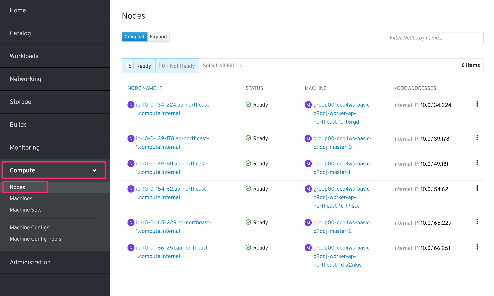
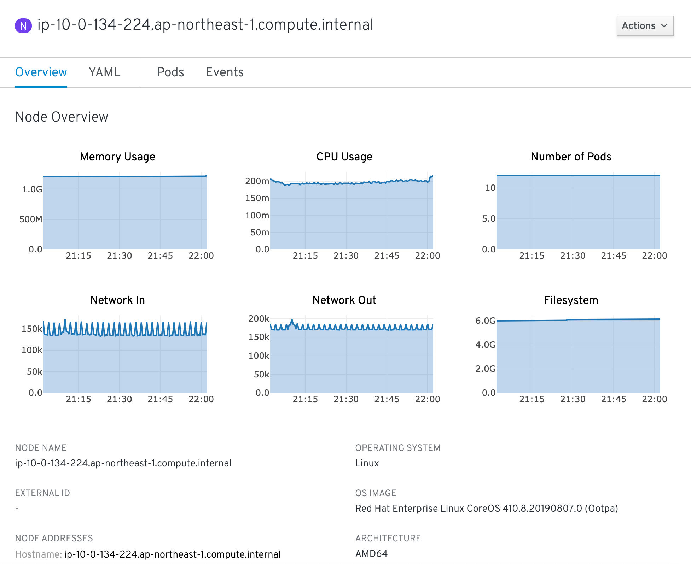
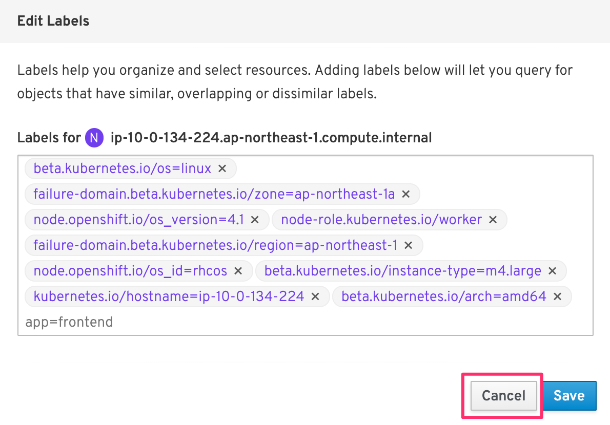

# 2. OCP4クラスターへのログインと動作確認
## 2-1. 諸注意
### 2-1-1. OpenShift4へのログイン方法
- **ocコマンド** : kubectlをwrapしたOpenShiftを制御するCLIでログイン
  - `oc login <OCP_MASTER_API>`: 任意のユーザーでログイン
  - `oc get pods -n default`: defaultネームスペースのPodを一覧表示
  - `kubectl get pods -n default` : kubectlも使用可
  - etc.
- **OCPコンソール** : OpenShiftの専用コンソール画面にブラウザからログイン
  - PodやDeployment，Secretなどのワークロードや，ServiceやPVCなどの作成および編集
  - ワークロードやNodeの状態確認やモニタリング
  - カタログからのミドルウェア，アプリケーションのデプロイ
  - クラスター設定やネームスペース，ロール管理などのAdmin作業
  - etc.
### 2-1-2. 事前準備
- For Self-handson
  - OpenShift Container Platform 4.Xクラスター環境
  - ocコマンドのセットアップ
  - system:adminの権限
- For Workshop参加者
  - 踏み台サーバー(Bastion Server)へのアクセス情報
  - OpenShift4クラスターへのアクセス情報

**以降の手順は，Workshop参加者を対象とした内容で記載しています。**  
**Self-handsonとして実施される方は，適宜ご自身の環境情報に読み替えて実施ください。**

## 2-2. OCP4へのログイン
### 2-2-1. ocコマンドによるログイン(oc login)
1. 踏み台サーバー(Bastion Server)にSSHでログインします。
    ```
    $ ssh -i <Private_Key> <Bastion_User_ID>@<Bastion_Server_IP>
  
    y
    ```

    >**※注意: ワークショップ参加者の方は，必ず自身に割当てられた <Bastion_User_ID>，<Bastion_Servier_IP>，<Private_Key> を使用してください。**  
    >
    >
    >例) 「踏み台サーバー(Bastion Server)」のSSHログイン情報
    > - `<Bastion_User_ID>`: **user00**
    > - `<Bastion_Server_IP>`: **1.2.3.4**
    > - `<Private_Key>`: **bs-key.pem**
    >
    >実行例) 
    >```
    >$ ssh -i bs-key.pem user00@1.2.3.4
    >```

1. OCP4クラスターにocコマンドでログインします。

    ```
    $ oc login <OpenShift_API>

    Username: "<User_ID>" を入力
    Password: "<User_PW>" を入力
    ```

    >**※注意: ワークショップ参加者の方は，必ず自身に割当てられた <OpenShift_API>，<User_ID>，<User_PW> を使用してください。**  
    >
    >
    >例) 「OpenShift_API」へのログイン情報
    > - `<OpenShift_API>`: **https://api.group00-ocp4ws-basic.capsmalt.org:6443**
    > - `<User_ID>`: **user00**
    > - `<User_PW>`: **ocppass**
    >
    >実行例) 
    >```
    >$ oc login https://api.group00-ocp4ws-basic.capsmalt.org:6443  
    >Username: user00
    >Password: ocppass
    >```

### 2-2-2. ブラウザからOCP4コンソールへのログイン
ブラウザ(Chrome or Firefox)からOpenShiftのコンソールにログインします。

>**注意: ワークショップ参加者の方は，必ず自身に割当てられた <OpenShift_Console>，<User_ID>，<User_PW> を使用してください。**  
>例) 「OpenShift4コンソール」のログイン情報
> - `<OpenShift_Console>`: **https://console-openshift-console.apps.group00-ocp4ws-basic.capsmalt.org**
> - `<User_ID>`: **user00**
> - `<User_PW>`: **ocppass**
>
>実行例)
> - ブラウザで https://console-openshift-console.apps.group00-ocp4ws-basic.capsmalt.org にアクセス
>   - capsmalt's group を選択
>   - user00 / ocppass を入力してログイン

Privacy Errorが出た場合は，[Advanced] > [Proceed to oauth-openshift.apps.group00-ocp4ws-basic.capsmalt.org (unsafe)] のように選択して進めてください。


[capsmalt's group] を選択し，ログイン情報を入力してコンソールにログインします。


## 2-3. OCP4クラスターの動作確認
コンソールやocコマンドでクラスターの状態について確認しましょう。ただし基本的には参照系(oc get pod, oc describe deploy, oc logs xxx, etc.)を使用することにしましょう。  

はじめに，ocコマンド or コンソールのいずれかで各自のプロジェクトを作成しましょう。  

>**※注意: クラスターを壊さない，他の人に影響を与えないようにするために重要です。必ず実施しましょう。**
> - 他の人と重複しないプロジェクトを作成すること (例: `oc new-project user00-lab1-2`)

[ocコマンドでプロジェクト作成する場合]
```
$ oc new-project <Project_Name> # (プロジェクトの作成) 
$ oc project <Project_Name> # (プロジェクトの指定)
```

>実行例)
>
>```
>$ oc new-project user00-lab1-2
>$ oc project user00-lab1-2
>```

[コンソール上でプロジェクト作成する場合]
1. [Home] > [Projects] > [Create Project] を選択します。  

    

    >コンソール右上のユーザー名が自身の<User_ID>であることを確認しましょう

1. プロジェクト名(例: `user00-lab1-2` )を指定し，**Create** を選択します。  

    


    

    また，作成したプロジェクトは，[Home] > [Projects] と辿ることで確認できます。

    

**以降の手順は，基本的には各自のプロジェクト内で実施します。**

### 2-3-1. プロジェクトの確認
1. [Home] > [Status] > [Projects: 自身のプロジェクト] > [Dashboard] を選択します。

    

    以下のような画面が表示されます。ただ，作成したばかりのプロジェクトなので特に情報がありません。

    

1. [Projects:]のプルダウンメニューから [openshift-console] を選択します。

    

    openshift-consoleプロジェクトにおけるCPUやメモリなどのリソース利用状況が確認できました。  
    さらに下方では，Podによるメモリ利用量と，利用量の大きい順にTOP10が一覧表示されています。  

    
  
1. openshift-consoleプロジェクトの利用状況について詳細に見ていきます。

    グラフ内にカーソルを合わせて選択します。

    

    ログインを求められた場合は，OCP4クラスターへのログイン情報を使用します。  

    

    Authorized Accessのページが表示されたら，[Allow selected permissions]を選択します。
    >モニタリングツール(Prometheus)に対して，ReadOnlyで情報利用する許可を与えています。

    

    openshift-consoleプロジェクト(=openshift-consoleネームスペース)内のコンテナCPU利用量のグラフが描画されました。

    

    >折れ線グラフにカーソルを合わせると詳細情報が表示されます。
    >Prometheusに対して，以下のQueryを投げることで上図の情報を抽出しています。
    > - Query: `namespaces:container_cpu_usage:sum{namespace='openshift-console'}`

1. 任意のメトリクスを指定して描画してみます。

    [- insert metric at cursol -] を選択します。  

    

    例では，[apiserver_request_count] > Execute にように選択します。  

      

    以下図のように折れ線グラフが描画され，下部にはリクエストが一覧されています。カーソルをグラフなどに合わせて詳細情報を確認してみましょう。  

      

OpenShift4では，各プロジェクト(ネームスペース)に属するあらゆるリソースのメトリクスを初期状態で取得できるようになっています。PrometheusやGrafanaなどを使うことでモニタリングおよび描画を実現しています。

1. 最後に，グラフ描画のタブ(Prometheus-Grafana用に開かれたタブ)をクローズしておきます。

    

### 2-3-2. Nodeの確認
OpenShift4クラスターはIPIでデフォルト構成でインストールした場合，Master3台/Worker3台の計6台のNode群で構成されます。  
Nodeの状態について確認してみましょう。

>**注意:**  
>**Nodeの確認については確認をするだけです。変更は行わないようにしてください。**  
>**複数人でクラスターを共用しているため，変更を加えてしまうと他の方の作業に影響が出てしまいます。**  
>

1. [Compute] > [Nodes] を選択します。

    

    デフォルトでは [Compact]タブが選択されており，例えば `
ip-10-0-134-224.ap-northeast-1.compute.internal` のような名称で，計6台のNodeが一覧されています。また，MACHINE欄を見ると，`
group00-ocp4ws-basic-b9qqj-worker-ap-northeast-1a-t6rgd` や `group00-ocp4ws-basic-b9qqj-master-0` のようにMaster/Workerの文字列が確認できます。

1. [Compute] > [Nodes] > [Expand] を選択して詳細情報を一覧表示します。(上図の状態から [Expand]タブを選択できます)

    
    
    紫色のテキストで各Nodeに付与されたラベルが表現されています。

    >yamlの場合
    >```
    >labels:
    >  beta.kubernetes.io/os: linux
    >  failure-domain.beta.kubernetes.io/zone: ap-northeast-1a
    >  node-role.kubernetes.io/worker: ''
    >  failure-domain.beta.kubernetes.io/region: ap-northeast-1
    >  node.openshift.io/os_id: rhcos
    >  beta.kubernetes.io/instance-type: m4.large
    >  kubernetes.io/hostname: ip-10-0-134-224
    >  beta.kubernetes.io/arch: amd64
    > 
    >```

1. 任意のWorkerを選択して詳細を確認します。

    
    
    [Overview]タブでは，選択した単一のNodeのCPUやメモリなどのリソース利用状況が確認できます。  
    プロジェクトと同様に，OpenShift4にデフォルト構成されているPrometheusが各メトリクスを抽出しています。
    
    

    [YAML]タブでは，OpenShift4上で管理されるNode情報をyaml形式で確認できます。  
    例えば，ラベル情報(上述)など確認できます。
    
    
    
    [Pods]タブでは，あるNode上で動作するPod一覧を確認できます。  
    例えば，`openshift-monitoringネームスペース`に属する grafanaのPodや，alertManagerなどが動作していることが分かります。
    
    
    
    [Events]タブでは，Nodeに起こったイベントについて時系列に表示されます。現時点では何も起こっていないので出力はありませんが，Nodeのステータスが変わったり，例えば割当リソースが変わったりなどの変化が起こると出力されます。
    
1. Nodeに対する操作(Action)を以下図のようにメニューを開いて確認します。
    
    

    ラベルやアノテーションの変更をUIから簡易的に行えます。  
    

    

    Node構成について，yamlを直接編集して変更が行えます。  
    
    
    [Mark as Unschedulable] を選択することで，今後新しいPodが該当Nodeにスケジューリングされないように設定できます。  
        
    
### 2-3-3. ワークロードの確認
### 2-3-4. モニタリング機能の確認

---
以上で，OCP4クラスターへのログインと動作確認は完了です。  
次に [コンテナイメージのビルドとデプロイ](3_ocp4-build-deploy.md) のハンズオンに進みます。

