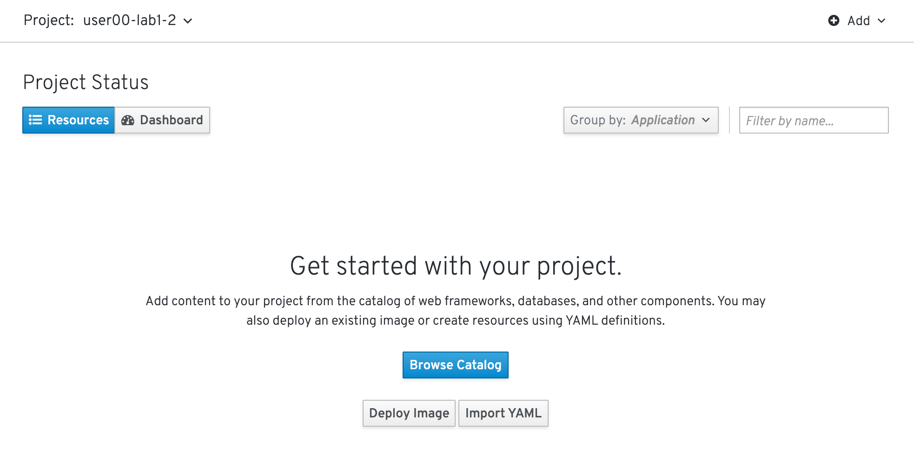

# 2. OpenShift4クラスターへのログインと動作確認
各自のOpenShift4クラスターに実際に接続し，クラスター内コンポーネントの動作確認を次の手順で行います。  
- A) OpenShift4クラスターへのログイン ([2-2](https://github.com/capsmalt/ocp4ws-basic/blob/master/Lab1/2_ocp4-tour.md#2-2-OpenShift4%E3%81%B8%E3%81%AE%E3%83%AD%E3%82%B0%E3%82%A4%E3%83%B3))
- B) プロジェクト(openshift-console)のリソース利用状況の確認 ([2-3-1](https://github.com/capsmalt/ocp4ws-basic/blob/master/Lab1/2_ocp4-tour.md#2-3-1-%E3%83%97%E3%83%AD%E3%82%B8%E3%82%A7%E3%82%AF%E3%83%88%E3%81%AE%E3%83%AA%E3%82%BD%E3%83%BC%E3%82%B9%E5%88%A9%E7%94%A8%E7%8A%B6%E6%B3%81%E3%81%AE%E7%A2%BA%E8%AA%8D))
- C) クラスターを構成するNodeの確認 ([2-3-2](https://github.com/capsmalt/ocp4ws-basic/blob/master/Lab1/2_ocp4-tour.md#2-3-2-%E3%82%AF%E3%83%A9%E3%82%B9%E3%82%BF%E3%83%BC%E3%82%92%E6%A7%8B%E6%88%90%E3%81%99%E3%82%8Bnode%E3%81%AE%E7%A2%BA%E8%AA%8D))
- D) K8sワークロード の動作確認 ([2-3-3](https://github.com/capsmalt/ocp4ws-basic/blob/master/Lab1/2_ocp4-tour.md#2-3-3-k8s%E3%83%AF%E3%83%BC%E3%82%AF%E3%83%AD%E3%83%BC%E3%83%89-%E3%81%AE%E5%8B%95%E4%BD%9C%E7%A2%BA%E8%AA%8D-oc%E3%82%B3%E3%83%9E%E3%83%B3%E3%83%89%E4%BD%BF%E7%94%A8))


## 2-1. 諸注意
### 2-1-1. OpenShift4へのログイン方法
- **ocコマンド** : kubectlをwrapしたOpenShift4を制御するCLIでログイン
  - `oc login <OpenShift_API>`: 任意のユーザーでログイン
  - `oc get pods -n default`: defaultネームスペースのPodを一覧表示
  - `kubectl get pods -n default` : kubectlも使用可
  - etc.
- **OpenShift4コンソール** : OpenShift4の専用コンソール画面にブラウザからログイン
  - PodやDeployment，Secretなどのワークロードや，ServiceやPVCなどの作成および編集
  - ワークロードやNodeの状態確認やモニタリング
  - カタログからのミドルウェア，アプリケーションのデプロイ
  - クラスター設定やネームスペース，ロール管理などのAdmin作業
  - etc.
### 2-1-2. 事前準備
- 踏み台サーバー(Bastion Server)へのアクセス情報
- OpenShift4クラスターへのアクセス情報

>自身でハンズオンを実施される場合は，事前に以下を準備ください。
> - OpenShift4クラスター環境
> - ocコマンドのセットアップ
> - 利用ユーザーへのcluster-adminの権限付与

## 2-2. OpenShift4へのログイン
### 2-2-1. ocコマンドによるログイン(oc login)
1. 踏み台サーバー(Bastion Server)にSSHでログインします。
    ```
    $ ssh -i <Private_Key> <Bastion_User_ID>@<Bastion_Server_IP>
  
    y
    ```

    >**※注意: ワークショップ参加者の方は，必ず自身に割当てられた <Bastion_User_ID>，<Bastion_Servier_IP>，<Private_Key> を使用してください。**  
    >
    >
    >例) 「踏み台サーバー(Bastion Server)」のSSHログイン情報
    > - `<Bastion_User_ID>`: **user00**
    > - `<Bastion_Server_IP>`: **1.2.3.4**
    > - `<Private_Key>`: **bs-key.pem**
    >
    >実行例) 
    >```
    >$ ssh -i bs-key.pem user00@1.2.3.4
    >```

1. OpenShift4クラスターにocコマンドでログインします。

    ```
    $ oc login <OpenShift_API>

    Username: "<User_ID>" を入力
    Password: "<User_PW>" を入力
    ```

    >**※注意: ワークショップ参加者の方は，必ず自身に割当てられた <OpenShift_API>，<User_ID>，<User_PW> を使用してください。**  
    >
    >
    >例) 「OpenShift_API」へのログイン情報
    > - `<OpenShift_API>`: **https://api.group00-ocp4ws-basic.capsmalt.org:6443**
    > - `<User_ID>`: **user00**
    > - `<User_PW>`: **openshift**
    >
    >実行例) 
    >```
    >$ oc login https://api.group00-ocp4ws-basic.capsmalt.org:6443  
    >Username: user00
    >Password: openshift
    >```

### 2-2-2. ブラウザからOpenShift4コンソールへのログイン
ブラウザ(Chrome or Firefox)からOpenShift4のコンソールにログインします。

>**注意: ワークショップ参加者の方は，必ず自身に割当てられた <OpenShift_Console>，<User_ID>，<User_PW> を使用してください。**  
>例) 「OpenShift4コンソール」のログイン情報
> - `<OpenShift_Console>`: **https://console-openshift-console.apps.group00-ocp4ws-basic.capsmalt.org**
> - capsmalt's group を選択
> - `<User_ID>`: **user00**
> - `<User_PW>`: **openshift**

Privacy Errorが出た場合は，[Advanced] > [Proceed to oauth-openshift.apps.group00-ocp4ws-basic.capsmalt.org (unsafe)] のように選択して進めてください。


[capsmalt's group] を選択し，ログイン情報を入力してコンソールにログインします。


## 2-3. OpenShift4クラスターの動作確認
コンソールやocコマンドでクラスターの状態について確認しましょう。ただし基本的には**参照系のみ(oc get pod, oc describe deploy, oc logs xxx, etc.)を使用**します。

OpenShift4コンソールで各自のプロジェクトを作成しましょう。  

> - 他の人と重複しないプロジェクトを作成すること
> - 作成したプロジェクト以外に触れる際は，参照系操作のみとすること

1. [Home] > [Projects] > [Create Project] を選択します。  

    

    >コンソール右上のユーザー名が自身の<User_ID>であることを確認しましょう

1. プロジェクト名(例: `user00-lab1-2` )を指定し，**Create** を選択します。  

    


    

    また，作成したプロジェクトは，[Home] > [Projects] と辿ることで確認できます。

    

### 2-3-1. プロジェクトのリソース利用状況の確認
最初に，前の手順で作成した自身のプロジェクトを確認してみましょう。  
その後，他ユーザーとの共有プロジェクトである `openshift-consoleプロジェクト` のリソース利用状況を確認します。

**注意:**  
**プロジェクト確認については参照系のみです。変更は行わないようにしてください。複数人でクラスターを共用しているため，変更を加えてしまうと他の方の作業に影響が出てしまいます。**  

1. [Home] > [Status] > [Projects: 自身のプロジェクト] > [Dashboard] を選択します。

    

    以下のような画面が表示されます。ただ，作成したばかりのプロジェクトなので特に情報がありません。

    

1. [Projects:]のプルダウンメニューから [openshift-console] を選択します。

    

    openshift-consoleプロジェクトにおけるCPUやメモリなどのリソース利用状況が確認できました。  
    さらに下方では，Podによるメモリ利用量と，利用量の大きい順にTOP10が一覧表示されています。  

    
  
1. openshift-consoleプロジェクトの利用状況について詳細に見ていきます。

    グラフ内にカーソルを合わせて選択します。

    

    ログインを求められた場合は，OpenShift4クラスターへのログイン情報を使用します。  

    

    Authorized Accessのページが表示されたら，[Allow selected permissions]を選択します。
    >モニタリングツール(Prometheus)に対して，ReadOnlyで情報利用する許可を与えています。

    

    openshift-consoleプロジェクト(=openshift-consoleネームスペース)内のコンテナCPU利用量のグラフが描画されました。

    

    >折れ線グラフにカーソルを合わせると詳細情報が表示されます。
    >Prometheusに対して，以下のQueryを投げることで上図の情報を抽出しています。
    > - Query: `namespaces:container_cpu_usage:sum{namespace='openshift-console'}`

1. 任意のメトリクスを指定して描画してみます。

    [- insert metric at cursol -] を選択します。  

    

    例では，[apiserver_request_count] > Execute にように選択します。  

      

    以下図のように折れ線グラフが描画され，下部にはリクエストが一覧されています。カーソルをグラフなどに合わせて詳細情報を確認してみましょう。  

      

1. 自動で開かれたタブ(Prometheus-Grafanaの可視化)は，**モニタリングやロギングなど短期間で更新のある可視化画面であるため多量のリソースを消費**します。このため，必ずクローズしておきましょう。

OpenShift4では，各プロジェクト(ネームスペース)に属するあらゆるリソースのメトリクスを初期状態で取得できるようになっています。PrometheusやGrafanaなどを使うことでモニタリングおよび描画を実現しています。

### 2-3-2. クラスターを構成するNodeの確認
OpenShift4クラスターはIPIでデフォルト構成でインストールされた場合，Master3台/Worker3台の計6台のNode群で構成されます。  
Nodeの状態について確認してみましょう。

>**※今回は，Workerを6台に増強しています。このため，OpenShift4クラスターは9台のEC2で構成されています。**

**注意:**  
**・Node確認については参照系のみ**  
**・変更は行わないこと**  
**・複数人でクラスターを共用しているため，変更を加えてしまうと他の方の作業に影響が出ます**  

1. [Compute] > [Nodes] を選択します。

    

    デフォルトでは [Compact]タブが選択されており，例えば `
ip-10-0-134-224.ap-northeast-1.compute.internal` のような名称で，計6台のNodeが一覧されています。また，MACHINE欄を見ると，`
group00-ocp4ws-basic-b9qqj-worker-ap-northeast-1a-t6rgd` や `group00-ocp4ws-basic-b9qqj-master-0` のようにMaster/Workerの文字列が確認できます。

1. [Compute] > [Nodes] > [Expand] を選択して詳細情報を一覧表示します。(上図の状態から [Expand]タブを選択できます)

    
    
    例えば，上記のNodeのラベル(紫色のテキスト)をyaml表記すると以下のようになります。後ほどNode設定のyamlを確認しますので，その際に確認してみましょう。

    >```
    >labels:
    >  beta.kubernetes.io/os: linux
    >  failure-domain.beta.kubernetes.io/zone: ap-northeast-1a
    >  node-role.kubernetes.io/worker: ''
    >  failure-domain.beta.kubernetes.io/region: ap-northeast-1
    >  node.openshift.io/os_id: rhcos
    >  beta.kubernetes.io/instance-type: m4.large
    >  kubernetes.io/hostname: ip-10-0-134-224
    >  beta.kubernetes.io/arch: amd64
    > 
    >```

1. 任意のWorkerを選択して詳細を確認します。

    
    
    [Overview]タブでは，選択した単一のNodeのCPUやメモリなどのリソース利用状況が確認できます。  
    プロジェクトと同様に，OpenShift4にデフォルト構成されているPrometheusが各メトリクスを抽出しています。
    
    

    [YAML]タブでは，OpenShift4上で管理されるNode情報をyaml形式で確認できます。Node名やアノテーション，さきほど確認したラベルなどの記載があります。
    
    
    
    [Pods]タブでは，指定したNode上で動作するPod一覧を確認できます。  
    例えば，`openshift-monitoringネームスペース`に属する grafanaのPodや，alertManagerなどが動作していることが分かります。
    
    
    
    [Events]タブでは，Nodeに起こったイベントについて時系列に表示されます。現時点では何も起こっていないので出力はありませんが，Nodeのステータスが変わったり，例えば割当リソースが変わったりなどの変化が起こると出力されます。
    
1. Nodeに対する操作(Action)を以下図のようにメニューを開いて確認します。
    
      

    ラベルの追加や削除などの変更をUI上で簡易的に行えます。  
    今回は編集しないので，**[Cancel]** を選択してクローズします。  

      

    アノテーションの追加や削除などの変更をUI上で簡易的に行えます。  
    今回は編集しないので，**[Cancel]** を選択してクローズします。  

      

    Node構成について，yamlを直接編集して変更が行えます。  
    今回は編集しないので，**[Cancel]** を選択してクローズします。  

      
    
    [Mark as Unschedulable] を選択することで，今後新しいPodが該当Nodeにスケジューリングされないように設定できます。  
    今回は編集しないので，**[Cancel]** を選択してクローズします。  

      

コンソール上で，OpenShift4クラスターを構成するNodeの数や種類，付与されたラベル，リソース利用状況，あるNode上で動作中のPod，Nodeの構成変更，などについて確認しました。

### 2-3-3. K8sワークロード の動作確認 (ocコマンド使用)
ocコマンドを使用して，K8sワークロードの動作状況を確認してみましょう。  

>クラスターにログインしてない場合は，`$ oc login <OpenShift_API>` でログインします。  
>
>ocコマンドでのログイン方法が分からない場合は，[2-2-1. ocコマンドによるログイン(oc login)](2_ocp4-tour.md#2-2-1-oc%E3%82%B3%E3%83%9E%E3%83%B3%E3%83%89%E3%81%AB%E3%82%88%E3%82%8B%E3%83%AD%E3%82%B0%E3%82%A4%E3%83%B3oc-login)を参照ください。
>

1. クラスターに含まれるプロジェクトを一覧します。

    ```
    $ oc get project

    NAME                                                    DISPLAY NAME   STATUS
    default                                                                Active
    kube-public                                                            Active
    kube-system                                                            Active
    openshift                                                              Active
    openshift-apiserver                                                    Active
    openshift-apiserver-operator                                           Active
    openshift-authentication                                               Active
    openshift-authentication-operator                                      Active
    openshift-cloud-credential-operator                                    Active
    openshift-cluster-machine-approver                                     Active
    openshift-cluster-node-tuning-operator                                 Active
    openshift-cluster-samples-operator                                     Active
    openshift-cluster-storage-operator                                     Active
    openshift-cluster-version                                              Active
    openshift-config                                                       Active
    openshift-config-managed                                               Active
    openshift-console                                                      Active
    openshift-console-operator                                             Active
    openshift-controller-manager                                           Active
    openshift-controller-manager-operator                                  Active
    openshift-dns                                                          Active
    openshift-dns-operator                                                 Active
    openshift-etcd                                                         Active
    openshift-image-registry                                               Active
    openshift-infra                                                        Active
    openshift-ingress                                                      Active
    openshift-ingress-operator                                             Active
    openshift-kube-apiserver                                               Active
    openshift-kube-apiserver-operator                                      Active
    openshift-kube-controller-manager                                      Active
    openshift-kube-controller-manager-operator                             Active
    openshift-kube-scheduler                                               Active
    openshift-kube-scheduler-operator                                      Active
    openshift-machine-api                                                  Active
    openshift-machine-config-operator                                      Active
    openshift-marketplace                                                  Active
    openshift-monitoring                                                   Active
    openshift-multus                                                       Active
    openshift-network-operator                                             Active
    openshift-node                                                         Active
    openshift-operator-lifecycle-manager                                   Active
    openshift-operators                                                    Active
    openshift-sdn                                                          Active
    openshift-service-ca                                                   Active
    openshift-service-ca-operator                                          Active
    openshift-service-catalog-apiserver-operator                           Active
    openshift-service-catalog-controller-manager-operator                  Active
    user00-lab1-2                                                          Active
    ```

1. 2-3. で作成した自身のプロジェクトを検索し，操作対象として切替えます。

    ```
    $ oc get project | grep user00*

    user00-lab1-2                                                          Active
    ```

    プロジェクトを切替えて操作してみましょう。
    ```
    $ oc project <自身のプロジェクト>
    ```

    >実行例)  
    >```
    >$ oc project user00-lab1-2
    >
    >Now using project "user00-lab1-2" on server "https://api.group00-ocp4ws-basic.capsmalt.org:6443".
    >```

    >Tips:
    >` $ oc project` でプロジェクトしておくことで，`-n user00-lab1-2` のようにネームスペース指定をする必要が無くなるため幾分便利になります。  
    > ※ただし，本ハンズオンの実行例においては，`$ oc project <プロジェクト名>` の実行有無に関係無く `-n` オプションを付与しています。  

1. 自身のプロジェクト内のワークロードを確認します。
    > コマンド実行時は，`-n <各自のプロジェクト名>` に読み替えてください。

    ```
    $ oc get po -n user00-lab1-2
    No resources found.

    $ oc get deploy -n user00-lab1-2    
    No resources found.

    $ oc get svc -n user00-lab1-2
    No resources found.
    ```

    自身のプロジェクトでは，まだ何もK8sワークロードを作成していないため，上記例の通り "No resource found." が出力されます。
    
1. openshift-console プロジェクト のワークロードを確認します。

    ```
    $ oc get po -n openshift-console
    NAME                         READY   STATUS    RESTARTS   AGE
    console-855bff5f9c-rhnmm     1/1     Running   0          16h
    console-855bff5f9c-xvttg     1/1     Running   1          16h
    downloads-5dc69d497c-7kvxb   1/1     Running   0          16h
    downloads-5dc69d497c-dxvz7   1/1     Running   0          16h
    
    $ oc get deploy -n openshift-console
    NAME        READY   UP-TO-DATE   AVAILABLE   AGE
    console     2/2     2            2           16h
    downloads   2/2     2            2           16h
    
    $ oc get svc -n openshift-console
    NAME        TYPE        CLUSTER-IP       EXTERNAL-IP   PORT(S)   AGE
    console     ClusterIP   172.30.159.179   <none>        443/TCP   16h
    downloads   ClusterIP   172.30.220.192   <none>        80/TCP    16h
    ```

ocコマンドは，Kubernetesを拡張したOpenShift4の制御をシンプルに行うために用意されているCLIですが，kubectlと同じ制御が行えます。例えば，`$ kubectl describe po`と同じ操作を `$ oc describe po` で行えます。余談ですが，もちろんkubectlコマンドをOpenShift4で使うこともできます。  

OpenShift4によって拡張された機能については，次のハンズオン([コンテナイメージのビルドとデプロイ](3_ocp4-build-deploy.md))で体験できます。  

---
以上で，OpenShift4クラスターへのログインと動作確認は完了です。  
次に [コンテナイメージのビルドとデプロイ](3_ocp4-build-deploy.md) のハンズオンに進みます。

