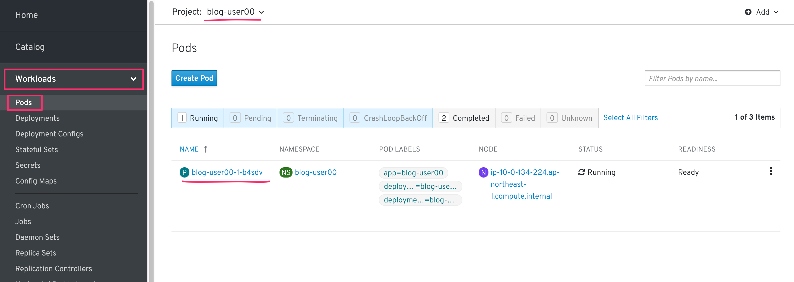

# 3. コンテナイメージのビルドとデプロイ
アプリケーションをOpenShift4クラスターで動作させます。Developer Catalogのテンプレートを使用してアプリケーションをデプロイします。

- A) 新規プロジェクトの作成 [(3-3-1)](https://github.com/capsmalt/ocp4ws-basic/blob/master/Lab1/3_ocp4-build-deploy.md#3-3-1-%E3%83%97%E3%83%AD%E3%82%B8%E3%82%A7%E3%82%AF%E3%83%88namespace%E3%81%AE%E4%BD%9C%E6%88%90)
- B) カタログからデプロイ [(3-3-2)](https://github.com/capsmalt/ocp4ws-basic/blob/master/Lab1/3_ocp4-build-deploy.md#3-3-2-%E3%82%AB%E3%82%BF%E3%83%AD%E3%82%B0%E3%81%A7%E3%82%BD%E3%83%BC%E3%82%B9%E3%82%92%E6%8C%87%E5%AE%9A%E3%81%97%E3%81%A6%E3%83%93%E3%83%AB%E3%83%89%E3%83%87%E3%83%97%E3%83%AD%E3%82%A4)
- C) アプリのPod動作の確認 [(3-3-3)](https://github.com/capsmalt/ocp4ws-basic/blob/master/Lab1/3_ocp4-build-deploy.md#3-3-3-blog%E3%82%A2%E3%83%97%E3%83%AA%E3%82%B1%E3%83%BC%E3%82%B7%E3%83%A7%E3%83%B3%E3%81%AE%E7%8A%B6%E6%85%8B%E3%82%92%E7%A2%BA%E8%AA%8D)
- D) Routerの作成 [(3-3-4)](https://github.com/capsmalt/ocp4ws-basic/blob/master/Lab1/3_ocp4-build-deploy.md#3-3-4-%E5%A4%96%E9%83%A8%E3%81%8B%E3%82%89%E3%82%A2%E3%82%AF%E3%82%BB%E3%82%B9%E3%81%99%E3%82%8B%E3%81%9F%E3%82%81%E3%81%AE-route-%E3%82%92%E4%BD%9C%E6%88%90)
- E) アプリの動作確認 [(3-3-5)](https://github.com/capsmalt/ocp4ws-basic/blob/master/Lab1/3_ocp4-build-deploy.md#3-3-5-%E3%82%A2%E3%83%97%E3%83%AA%E3%82%B1%E3%83%BC%E3%82%B7%E3%83%A7%E3%83%B3%E3%81%AE%E5%8B%95%E4%BD%9C%E7%A2%BA%E8%AA%8D)

## 3-1. 諸注意
### 3-1-1. OpenShift4におけるデプロイについて
OpenShiftでは，いくつかの方法でアプリケーションをクラスター上にデプロイすることができます。

- 既存のDockerイメージを使ってデプロイする方法
- ソースコードとS2I(ツール)を使ってビルド&デプロイする方法
- ソースコードとDockerfileを使ってビルド&デプロイする方法

### 3-1-2. 事前準備
- 踏み台サーバー(Bastion Server)へのアクセス情報
- OpenShift4クラスターへのアクセス情報

>自身でハンズオンを実施される場合は，事前に以下を準備ください。
> - OpenShift4クラスター環境
> - ocコマンドのセットアップ

## 3-2. OpenShift4コンソールへのログイン
ブラウザを立ち上げて **OpenShift4コンソール** に接続します。

>ログイン方法を再確認したい場合は，[ブラウザからOpenShift4コンソールへのログイン](2_ocp4-tour.md#2-2-2-%E3%83%96%E3%83%A9%E3%82%A6%E3%82%B6%E3%81%8B%E3%82%89OpenShift4%E3%82%B3%E3%83%B3%E3%82%BD%E3%83%BC%E3%83%AB%E3%81%B8%E3%81%AE%E3%83%AD%E3%82%B0%E3%82%A4%E3%83%B3)を参照ください。  
>
>ログイン方法だけでなく，クラスター内コンポーネントの基本的な動作確認も行いたい場合は，以前のハンズオン[OpenShift4クラスターへのログインと動作確認(Lab1-2)](2_ocp4-tour.md)を実施してください。

## 3-3. コンテナイメージのビルドとデプロイ
S2I(Source-to-Image)というツールを使って以下の2つのコンポーネントからコンテナイメージを生成し，コンテナアプリケーションをデプロイします。

- **リポジトリURL** : GitHubなどソースコード格納場所
- **S2I Builder Image** : S2Iスクリプトが含まれているDockerイメージ

またOpenShift4は，カタログ機能(Developer Catalog)を備えています。JavaやPython，nginxなどのS2I Builder Imageをカタログ上で選択，あるいはカタログ上に追加でき，アプリケーションを簡単にOpenShift4上にデプロイできます。

新規にプロジェクトを作成し，サンプルのコードとPython用のS2I Builder Imageを使ってコンテナイメージを作成し，アプリケーションをOpenShift4上にデプロイしてみましょう。

### 3-3-1. プロジェクト(Namespace)の作成
OpenShift4コンソールで各自のプロジェクトを作成しましょう。  

1. [Home] > [Projects] > [Create Project] を選択します。  

    

    >コンソール右上のユーザー名が自身の<User_ID>であることを確認しましょう

1. プロジェクト名(例: `blog-user00` )を指定し，**Create** を選択します。  
    
    プロジェクト名には，**必ずご自身のログイン時のユーザー名 (例: "blog-user00")** を指定してください。  
    複数人でクラスターを共有しているため，他の人と重複しないプロジェクト名を指定する必要があります。  

    

    >Tips:
    >
    >OpenShift4ではプロジェクトを作成することで，新規Namespace(=プロジェクト名)が生成されます。NamespaceはK8sクラスターを論理的に分離させることが可能なK8sリソースの一種です。例えば，アプリA用のNamespaceを`ns_appa`，アプリB用のNamespaceを`ns_appb`のように作成することで，同一のK8sクラスター内に存在するns_appaとns_appbが干渉しないように構成することも可能です。

    

### 3-3-2. カタログでソースを指定してビルド&デプロイ
1. [Catalog] > [Developer Catalog] > [Python] テンプレート を選択します。

    

    >Tips:
    >
    >Developer CatalogからPythonアプリケーションを作成することで以下のリソースが作成されます。
    >- Build config
    >    - Gitリポジトリからソースコードをビルド
    >- Image stream
    >    - ビルド済イメージのトラッキング
    >- Deployment config    
    >    - イメージ変更の際に新リビジョンにロールアウト
    >- Service
    >    - クラスター内にワークロードを公開
    >- Route
    >    - クラスター外にワークロードを公開

1. アプリケーションのリポジトリなどを指定して，OpenShift4上にアプリケーションをデプロイします。

    最初に，**[Create Application]**　を選択します。  
    
    
    次に，**[リポジトリなどいくつかの項目]** を指定し，最後に **[Create]** を選択します。  

    - Namespace: `自身のプロジェクト名 (例: blog-user00)`
    - Version: `python:3.6`
    - Name:`任意の名前(例: blog-user00)`
    - Git Repoaitory: `https://github.com/openshift-katacoda/blog-django-py` 
    - Create route: `デフォルト(チェックを外した状態)`

    
    
    以上の手順で，blogアプリケーションをOpenShift4上にデプロイできました。  
    
    >Tips:
    >
    >下図のように，デプロイ直後は "0 of 1 pods" のように動作準備中の状態です。  
    >
    >  
    >
    >少し待つと，下図のように "1 of 1 pods" のように正常に動作した状態を確認できます。  
    >
    >  
    >
    
### 3-3-3. blogアプリケーションの状態を確認
1. [Workloads] > [Pods] > [指定したアプリ名 (例: blog-user00)] のように選択します。

    

    コンテナが作成され，起動していると以下のように表示されます。  
    
    

    >Tips:  
    >
    >以前の手順で[プロジェクトのリソース状況を確認 (2-3-1)](https://github.com/capsmalt/ocp4ws-basic/blob/master/Lab1/2_ocp4-tour.md#2-3-1-%E3%83%97%E3%83%AD%E3%82%B8%E3%82%A7%E3%82%AF%E3%83%88%E3%81%AE%E3%83%AA%E3%82%BD%E3%83%BC%E3%82%B9%E5%88%A9%E7%94%A8%E7%8A%B6%E6%B3%81%E3%81%AE%E7%A2%BA%E8%AA%8D)した時と同じようにPrometheus(+Grafana)のモニタリング状況を確認したり，yaml定義の確認，Eventの確認などができます。  
    >
    >さらに，Pod内のコンテナ内でコマンド実行も行えます。  
    >以下図のように [Terminal] を選択するとブラウザ上でターミナル内操作が行なえます。  
    >
    >
    >
    >Pod内に複数コンテナが存在する場合はプルダウンメニューで選択するだけでコンテナを切替えてターミナル操作が可能です。問題判別を行う際には，手間を省いてくれる意外と嬉しい機能です。

### 3-3-4. 外部からアクセスするための Route を作成
現在のblogアプリケーションは，OpenShift4クラスター内に閉じた状態ですので，外部からアクセスできるように Router を作成しましょう。  

1. [Networking] > [Routes] > [Create Route] を選択します。

    

1. **Router**，対象アプリ用の**Service**，**Port** を指定します。
    - Name: `任意の名前 (例: blog-user00)`
    - Service: `指定済のアプリ名 (例: blog-user00`
    - Target Port: `8080 → 8080(TCP)`
    
    
    
    >Tips:
    >
    >「あれ？Service作ったっけ？」と思われた方，その感覚は正しいです。明示的には作成していません。  
    >今回は[3-3-2の手順](https://github.com/capsmalt/ocp4ws-basic/blob/master/Lab1/3_ocp4-build-deploy.md#3-3-2-%E3%82%AB%E3%82%BF%E3%83%AD%E3%82%B0%E3%81%A7%E3%82%BD%E3%83%BC%E3%82%B9%E3%82%92%E6%8C%87%E5%AE%9A%E3%81%97%E3%81%A6%E3%83%93%E3%83%AB%E3%83%89%E3%83%87%E3%83%97%E3%83%AD%E3%82%A4) で，Pythonテンプレートでblogアプリケーションをデプロイした際に，Podだけでなく，"Service" も同時に作成されています。
    >その際，Service名はアプリ名と同じ名前が指定されています。
    >
    >Developer Catalogで選択したテンプレートは，Kubernetes上でアプリを動作させるために必ず必要になるリソース(PodやServiceなど)や，便利にアプリケーションを管理できるようにするための仕組みを一挙に作成できるように用意されています。
    >
    
1. 最後に **Create** を選択します。

    >Tips:
    >
    >作成したRouteを参照する場合は，[Networking] > [Routes] > [Router名] のように辿ることで確認できます。 
    >
    >
    
### 3-3-5. アプリケーションの動作確認
1. [Networking] > [Routes] を選択し，blog用のRouter(例: `blog-user00`)行にある **Location欄のリンク** を開きます。
    例) `http://blog-user00-blog-user00.apps.group00-ocp4ws-basic.capsmalt.org`

    

1. blogアプリのサンプルページに自身のPod名が表示されていることを確認します。

    
    
    Pod名が分からない場合は，[Workloads] > [Pods] のPod一覧から確認しましょう。  
    
    

## 3-4. [Trial works] - OpenShift4クラスターに他アプリケーションをデプロイ
お題: 

「**OpenShift4クラスターに他アプリケーションをS2Iでビルド&デプロイしてみよう**」

コンテンツ:

- Project名(NameSpace): `trial-<yourID>` (例: `trial-user00`)
- BaseImage(BuilderImage): `Python 3.6`
- Git Repository: `https://github.com/sclorg/django-ex`
- Routes名: `trial-<yourID>` 

---
以上で，コンテナイメージのビルドとデプロイ は完了です。  
