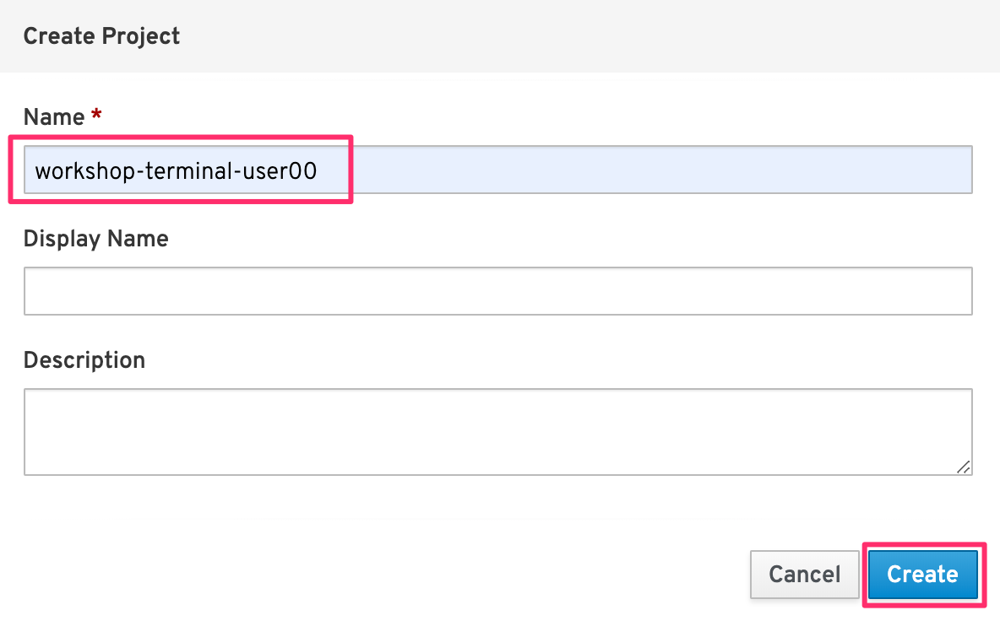
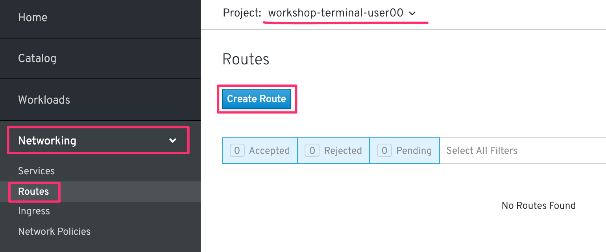

# 1. 既存のコンテナイメージのデプロイ
ビルド済(アプリケーションコードとビルダーイメージ(S2I BuilderImage)が結合済)の既存コンテナイメージをOpenShift4クラスターにデプロイします。

- A) プロジェクトの作成 ([1-2-1](https://github.com/capsmalt/ocp4ws-basic/blob/master/Lab2/1_ocp4-deploy-own-image.md#1-2-1-%E3%83%97%E3%83%AD%E3%82%B8%E3%82%A7%E3%82%AF%E3%83%88namespace%E3%81%AE%E4%BD%9C%E6%88%90))
- B) 既存コンテナイメージのデプロイ ([1-2-2](https://github.com/capsmalt/ocp4ws-basic/blob/master/Lab2/1_ocp4-deploy-own-image.md#1-2-2-%E6%97%A2%E5%AD%98%E3%82%B3%E3%83%B3%E3%83%86%E3%83%8A%E3%82%A4%E3%83%A1%E3%83%BC%E3%82%B8%E3%81%AE%E3%83%87%E3%83%97%E3%83%AD%E3%82%A4))
- C) Routerの作成 ([1-3-1](https://github.com/capsmalt/ocp4ws-basic/blob/master/Lab2/1_ocp4-deploy-own-image.md#1-3-1-%E5%A4%96%E9%83%A8%E3%82%A2%E3%82%AF%E3%82%BB%E3%82%B9%E3%81%AE%E3%81%9F%E3%82%81%E3%81%AErouter%E3%82%92%E4%BD%9C%E6%88%90))
- B) アプリケーションの動作確認 ([1-3-2](https://github.com/capsmalt/ocp4ws-basic/blob/master/Lab2/1_ocp4-deploy-own-image.md#1-3-2-%E3%82%A2%E3%83%97%E3%83%AA%E3%82%B1%E3%83%BC%E3%82%B7%E3%83%A7%E3%83%B3%E3%81%AE%E5%8B%95%E4%BD%9C%E7%A2%BA%E8%AA%8D))

## 1-1. 諸注意
### 1-1-1. 既存コンテナイメージについて
ここでいう "既存コンテナイメージ" は以下の2つが結合済のイメージのことを指しています。  
- アプリケーションコード
- Builder Image

### 1-1-2. 事前準備
- 踏み台サーバー(Bastion Server)へのアクセス情報
- OpenShift4クラスターへのアクセス情報

>自身でハンズオンを実施される場合は，事前に以下を準備ください。
> - OpenShift4クラスター環境
> - ocコマンドのセットアップ
>   - 自身のクラスターバージョンに合わせたクライアントを使用します
>   - https://mirror.openshift.com/pub/openshift-v4/clients/ocp/

## 1-2. 既存コンテナイメージをOpenShift4にデプロイ
Lab1ではソースコードとbuidler imageを合体させてコンテナイメージを作成し，OpenShift4上にデプロイしました。  
Lab2の最初のステップでは，**既にコンテナイメージ化済** のターミナルアプリケーションをOpenShift4上にデプロイする手順を実施します。

### 1-2-1. プロジェクト(Namespace)の作成
OpenShift4コンソールで各自のプロジェクトを作成しましょう。  

1. [Home] > [Projects] > [Create Project] を選択します。  

    

1. プロジェクト名(例: `workshop-terminal-user00` )を指定し，**Create** を選択します。  
    
    プロジェクト名には，**必ずご自身のログイン時のユーザー名 (例: "workshop-terminal-user00")** を指定してください。  
    複数人でクラスターを共有しているため，他の人と重複しないプロジェクト名を指定する必要があります。  

    

### 1-2-2. 既存コンテナイメージのデプロイ
1. **Add > Deploy Image** のように選択します。

    

1. **Namespace**(プロジェクト名)，と**Image Name** を指定します。
    - Namespace: `各自の作成済プロジェクト(例: workshop-terminal-user00)`
    - Image Name: `quay.io/openshiftlabs/workshop-terminal:2.4.0`

    

1. **検索ボタン** をクリックし，Name(workshop-terminal)を確認して，**Deploy** を選択します。

    

## 1-3. Routerの作成と動作確認
### 1-3-1. 外部アクセスのためのRouterを作成
現在のworkshop-terminalアプリケーションは，OpenShift4クラスター内に閉じた状態ですので，外部からアクセスできるように Router を作成しましょう。  

1. [Networking] > [Routes] > [Create Route] を選択します。

    

1. **Router**，対象アプリ用の**Service**，**Port** を指定します。
    - Name: `任意の名前 (例: workshop-terminal)`
    - Service: `指定済のアプリ名 (例: workshop-terminal)`
    - Target Port: `10080 → 10080(TCP)`
    
    

### 1-3-2. アプリケーションの動作確認
1. [Networking] > [Routes] を選択し，workshop-terminal用のRouter(例: `workshop-terminal`)行にある **Location欄のリンク** を開きます。
    例) `http://workshop-terminal-workshop-terminal-user00.apps.group00-ocp4ws-basic.capsmalt.org`

    

1. Terminalアプリが表示されることを確認します。

    

## 1-4. [Trial works] - OpenShift4上にアプリをデプロイ2
お題: 

「**workshop-terminalアプリの特定バージョン(2.10.2)を新規にデプロイして，Routerの振り先を変更してみよう**」

ヒント:

- プロジェクト名(既存): `workshop-terminal-<yourID>` (例: `workshop-terminal-user00`)
- ContainerImage(新規): `quay.io/openshiftlabs/workshop-terminal:2.10.2`
- アプリ名(新規): `workshop-terminal-2102`
- Service名(アプリ名と同じ名前で自動生成): `workshop-terminal-2102`
  - (このServiceをRouterからの新しい振り先に指定すると良さそう...)
- Router名(既存): `workshop-terminal`
  - 既存のRouterの振り先を変更してみる
  - ([Networking] > [Routes] > [workshop-terminal] > [YAML] の `"spec.to.name"` あたりが怪しい...)

---
以上で，既存のコンテナイメージのデプロイは完了です。  
次に [Jenkinsベースのビルドパイプラインの利用](https://github.com/capsmalt/ocp4ws-basic/blob/master/Lab2/2_ocp4-jenkins-pipeline.md) のハンズオンに進みます。
