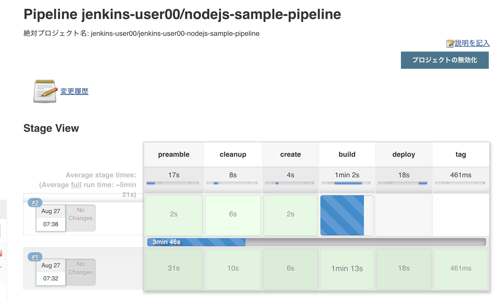

# 2. Jenkinsベースのビルドパイプラインの利用
自動化ツールとして有名なOSSのJenkinsを使ったビルドパイプラインを体験してみましょう。

- A) プロジェクトの作成 ([2-2-1_1](https://github.com/capsmalt/ocp4ws-basic/blob/master/Lab2/2_ocp4-jenkins-pipeline.md#2-2-1-jenkins%E3%82%B3%E3%83%B3%E3%83%86%E3%83%8A%E3%81%AE%E3%82%A4%E3%83%B3%E3%82%B9%E3%83%88%E3%83%BC%E3%83%AB))
- B) Jenkinsインスタンスのデプロイ ([2-2-1_2](https://github.com/capsmalt/ocp4ws-basic/blob/master/Lab2/2_ocp4-jenkins-pipeline.md#2-2-1-jenkins%E3%82%B3%E3%83%B3%E3%83%86%E3%83%8A%E3%81%AE%E3%82%A4%E3%83%B3%E3%82%B9%E3%83%88%E3%83%BC%E3%83%AB))
- C) Build Configの展開 ([2-2-2](https://github.com/capsmalt/ocp4ws-basic/blob/master/Lab2/2_ocp4-jenkins-pipeline.md#2-2-2-jenkins%E3%81%B8%E3%81%AE%E3%83%91%E3%82%A4%E3%83%97%E3%83%A9%E3%82%A4%E3%83%B3%E8%A8%AD%E5%AE%9A%E3%82%92%E6%A7%8B%E6%88%90))
- D) Jenkins Pipelineの実行 ([2-2-3](https://github.com/capsmalt/ocp4ws-basic/blob/master/Lab2/2_ocp4-jenkins-pipeline.md#2-2-3-%E3%83%93%E3%83%AB%E3%83%89%E3%83%91%E3%82%A4%E3%83%97%E3%83%A9%E3%82%A4%E3%83%B3%E3%81%AE%E5%AE%9F%E8%A1%8C))
- E) Pipelineとアプリの動作確認 ([2-2-4](https://github.com/capsmalt/ocp4ws-basic/blob/master/Lab2/2_ocp4-jenkins-pipeline.md#2-2-4-%E3%83%93%E3%83%AB%E3%83%89%E3%83%91%E3%82%A4%E3%83%97%E3%83%A9%E3%82%A4%E3%83%B3%E3%81%AE%E5%8B%95%E4%BD%9C%E7%A2%BA%E8%AA%8D))


## 2-1. 諸注意
### 2-1-1. OpenShift4におけるデリバリーパイプラインについて
- S2I (Source to Image)
- Jenkins Pipeline
- Tekton Pipeline

### 2-1-2. 事前準備
## 2-2. OpenShift4上でのJenkinsビルドパイプラインの利用
今回はCLI操作をメインに使用して進めてみましょう。

ocコマンドを使用して，クラスターにログインします。

`$ oc login <OpenShift_API>` 

>
>ocコマンドでのログイン方法が分からない場合は，[2-2-1. ocコマンドによるログイン(oc login)](https://github.com/capsmalt/ocp4ws-basic/blob/master/Lab1/2_ocp4-tour.md#2-2-1-oc%E3%82%B3%E3%83%9E%E3%83%B3%E3%83%89%E3%81%AB%E3%82%88%E3%82%8B%E3%83%AD%E3%82%B0%E3%82%A4%E3%83%B3oc-login)を参照ください。
>

### 2-2-1. Jenkinsコンテナのインストール
1. 新規プロジェクトを作成します。  **(例: jenkins-user00)**

    ```
    $ oc new-project jenkins-user00 (<== ご自身のプロジェクト名)
    $ oc project
    Using project "jenkins-user00" on server XXXXXXX
    
    上記のように出力確認できればOKです
    ```
    
1. Jenkinsテンプレートを使用してJenkinsのインスタンスをデプロイします。

    ```
    $ oc get templates -n openshift
    $ oc get templates -n openshift | grep jenkins

    jenkins-ephemeral: 永続化なし <== 今回はこちらを使用
    jenkins-persistent: 永続化あり

    $ oc new-app jenkins-ephemeral -n jenkins-user00  # -n 作成したプロジェクト名
    $ oc get pods
    $ oc project
    ```

### 2-2-2. Jenkinsへのパイプライン設定を構成
1. Jenkinsにパイプライン設定(nodejs-sample-pipeline)を入れます。

    ```
    $ oc create -f https://raw.githubusercontent.com/openshift/origin/master/examples/jenkins/pipeline/nodejs-sample-pipeline.yaml -n jenkins-user00
    
    $ oc get buildconfigs
    nodejs-sample-pipeline  # oc createで作成されたPipeline
    
    $ oc get buildconfig/nodejs-sample-pipeline -o yaml　# 中身を確認

### 2-2-3. ビルドパイプラインの実行
1. パイプラインを使用してビルドします。

    ```
    $ oc start-build nodejs-sample-pipeline
    ```

### 2-2-4. ビルドパイプラインの動作確認
1. JenkinsのUIに接続してパイプラインの進捗状況を確認します。

    ```
    $ oc get route
    NAME                     HOST/PORT                                                                      PATH   SERVICES                 PORT    TERMINATION     WILDCARD
    jenkins                  jenkins-jenkins-user00.apps.group00-ocp4ws-basic.capsmalt.org                         jenkins                  <all>   edge/Redirect   None
    ```
    
    上記出力結果の "HOST/PORT" の情報をコピーして，ブラウザのURL欄にペーストして確認します。  
    (例: `jenkins-jenkins-user00.apps.group00-ocp4ws-basic.capsmalt.org`)

    OpenShift4のログイン情報を使用してJenkinsのUIにログインします。
    
    
    
    **自身のプロジェクト名** を選択します。(例: jenkins-user00)
    
    

    **プロジェクト名/パイプライン名** を選択します (例: jenkins-user00/nodejs-sample-pipeline)
    
    

    時間経過とともにパイプラインのステージがだんだん右側に伸びていくことが確認できます

    

    一番右端まで到達し，オールグリーンであれば成功です。  
    
    
    

    パイプラインのステージの書き方は，前述の `oc get buildconfig/nodejs-sample-pipeline -o yaml`で確認できます。
    
    ```
    $ oc get buildconfig/nodejs-sample-pipeline -o yaml
    
    apiVersion: build.openshift.io/v1
    kind: BuildConfig
    ...
    metadata:
      ...
      name: nodejs-sample-pipeline
      namespace: jenkins-user00
      ...
    spec:
      ...
        ...
      strategy:
        jenkinsPipelineStrategy:
          jenkinsfile: |-
            // path of the template to use
            def templatePath = 'https://raw.githubusercontent.com/openshift/nodejs-ex/master/openshift/templates/nodejs-mongodb.json'
            def templateName = 'nodejs-mongodb-example'
            pipeline {
                agent {
                  node {
                    // spin up a node.js slave pod to run this build on
                    label 'nodejs'
                  }
                }
                options {
                    ...
                }

                stages {
                    stage('preamble') {
                        ...
                        ...
                        }
                    }
                    stage('cleanup') {
                        ...
                        ...
                        }
                    }                        
                    stage('create') {
                        steps {
                            script {
                                openshift.withCluster() {
                                    openshift.withProject() {
                                        // create a new application from the templatePath
                                        openshift.newApp(templatePath)
                                    }
                                }
                            } // script
                        } // steps
                    } // stage
                    stage('build') {
                        steps {
                            script {
                                openshift.withCluster() {
                                    openshift.withProject() {
                                        def builds = openshift.selector("bc", templateName).related('builds')
                                        builds.untilEach(1) {
                                            return (it.object().status.phase == "Complete")
                                        }
                                    }
                                }
                            } // script
                        } // steps
                    } // stage
                    stage('deploy') {
                        steps {
                            script {
                                openshift.withCluster() {
                                    openshift.withProject() {
                                        def rm = openshift.selector("dc", templateName).rollout()
                                        openshift.selector("dc", templateName).related('pods').untilEach(1) {
                                            return (it.object().status.phase == "Running")
                                        }
                                    }
                                }
                            } // script
                        } // steps
                    } // stage
                    stage('tag') {
                        steps {
                            script {
                                openshift.withCluster() {
                                    openshift.withProject() {
                                        // if everything else succeeded, tag the ${templateName}:latest image as ${templateName}-staging:latest
                                        // a pipeline build config for the staging environment can watch for the ${templateName}-staging:latest
                                        // image to change and then deploy it to the staging environment
                                        openshift.tag("${templateName}:latest", "${templateName}-staging:latest")
                                    }
                                }
                            } // script
                        } // steps
                    } // stage
                } // stages
            } // pipeline
        type: JenkinsPipeline
      successfulBuildsHistoryLimit: 5
      triggers: []
    status:
      lastVersion: 1
    ```

1. デプロイされたアプリケーションを確認しましょう。

    接続先となるRouterの情報を確認します。

    ```
    $ oc get route
    NAME                     HOST/PORT                                                                      PATH   SERVICES                 PORT    TERMINATION     WILDCARD
    jenkins                  jenkins-jenkins-user00.apps.group00-ocp4ws-basic.capsmalt.org                         jenkins                  <all>   edge/Redirect   None
    nodejs-mongodb-example   nodejs-mongodb-example-jenkins-user00.apps.group00-ocp4ws-basic.capsmalt.org          nodejs-mongodb-example   <all>                   None
    ```

    上記出力結果の "HOST/PORT" の情報をコピーして，ブラウザのURL欄にペーストして確認します。  
    (例: `nodejs-mongodb-example-jenkins-user00.apps.group00-ocp4ws-basic.capsmalt.org`)  

    
    
    
>Tips:
>
>Lab2ではCLIを用いたプロジェクト作成やアプリケーション作成，動作確認などの操作を中心としています。  
>また手順の中で，Jenkinsテンプレートを使用したJenkinsインスタンスのデプロイを行いました。
>
>ちなみに，Lab1では主にOpenShift4コンソール上(GUI)操作を使用しました。  
>カタログ(Developer Catalog) からPythonテンプレートを選択して，ソースコードとbuilder image(Python)を合体させることでコンテナイメージを作成し，デプロイしていました。  
>
>このように，OpenShift4ではCLI/GUI双方で同じ操作が行えます。また，JenkinsやPythonに限らず，ランタイムや他ミドルウェア，ソフトウェアなど多数のテンプレートを用意しています。S2Iスクリプトを書くことで，自身(自社)でよく使うテンプレートを自作してカタログ上に追加することも可能です。  

---
以上で，Jenkinsベースのビルドパイプラインの利用は完了です。  
