Lab2. Jenkinsベースのビルドパイプライン では以下の内容実施します。
- 既存コンテナイメージをシンプルにデプロイ
- Jenkinsを使用したビルドパイプライン体験

# 既存コンテナイメージを使ってOCPにデプロイ
- 既存コンテナイメージ -> OCP上にデプロイ
- Dockerfile -> コンテナイメージビルド -> OCP上にデプロイ
  - s2ibuildできる環境が必要
  - cri-o + buildah環境(RHEL8)が必要

Lab1ではソースコードとbuidler imageを合体させてコンテナイメージを作成し，OCP上にデプロイしました。Lab2の最初のステップでは，**既にコンテナイメージ化済**のターミナルアプリケーションをOCP上にデプロイする手順を実施します。

1. プロジェクトを選択します
    
    プロジェクトは，**必ずご自身のログイン時のユーザー名 (例: "user01a")** のものを選択してください。    
    Home > Project > user01a (例)
    
    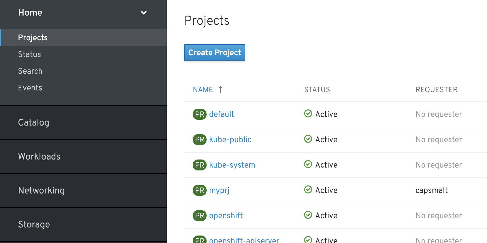

1. **Add > Deploy Image** のように選択します

    

1. **Namespace**(プロジェクト名)，と**Image Name** を指定します
    - Namespace: `各自の作成済プロジェクト(例: user01a)`
    - Image Name: `quay.io/openshiftlabs/workshop-terminal:2.4.0`

    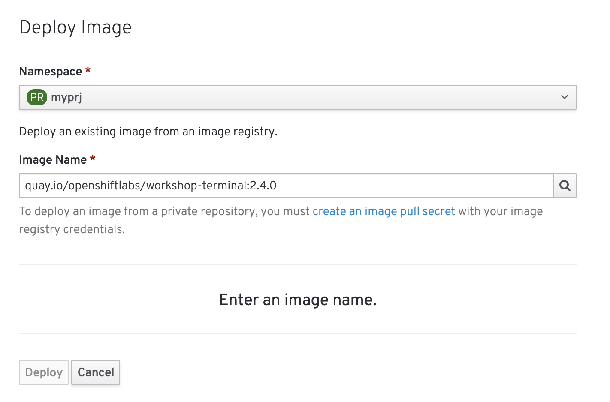

1. **検索ボタン** をクリックし，Name(workshop-terminal)を確認して，**Deploy** を選択します

    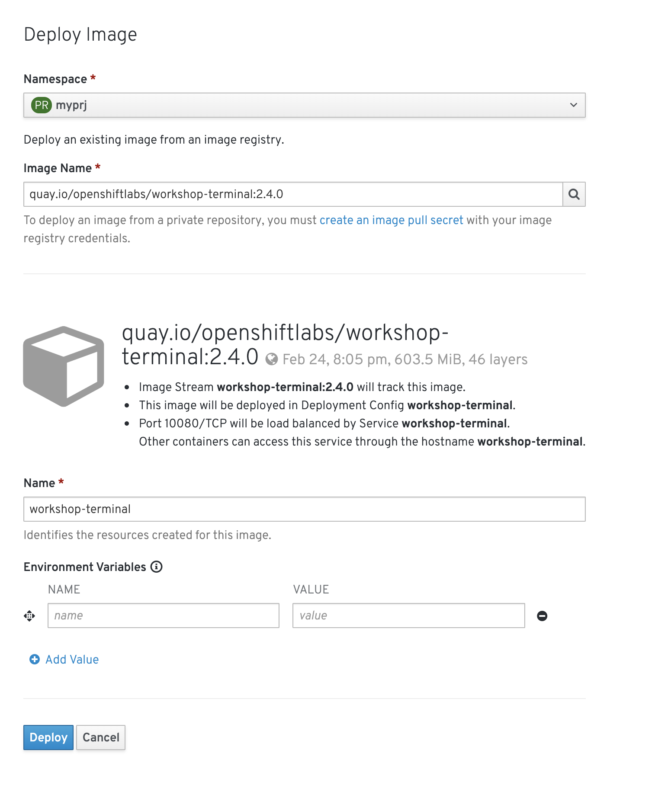

1. 外部からアクセスするための **Route** を作成します

    Networking > Routes > Create Route を選択し，以下を指定した後 **Create** を選択します
    - Name: `Route名(例: workshop-terminal)`
    - Service: `対象アプリ用のService(例: workshop-terminal)`
    - Target Port: `10080 → 10080(TCP)`

    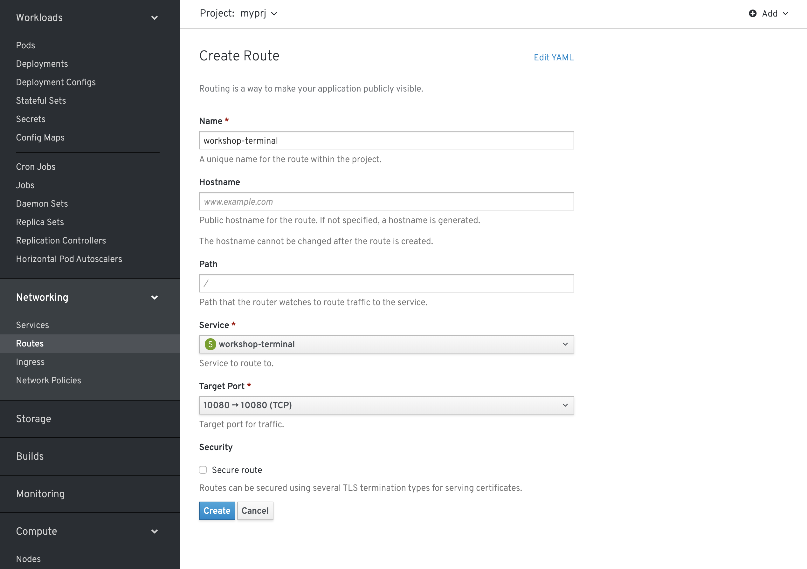

1. Location欄にあるリンクを開きます
    例: `http://workshop-terminal-myprj.apps.ocp41-ipi-0611.k8show.net`

    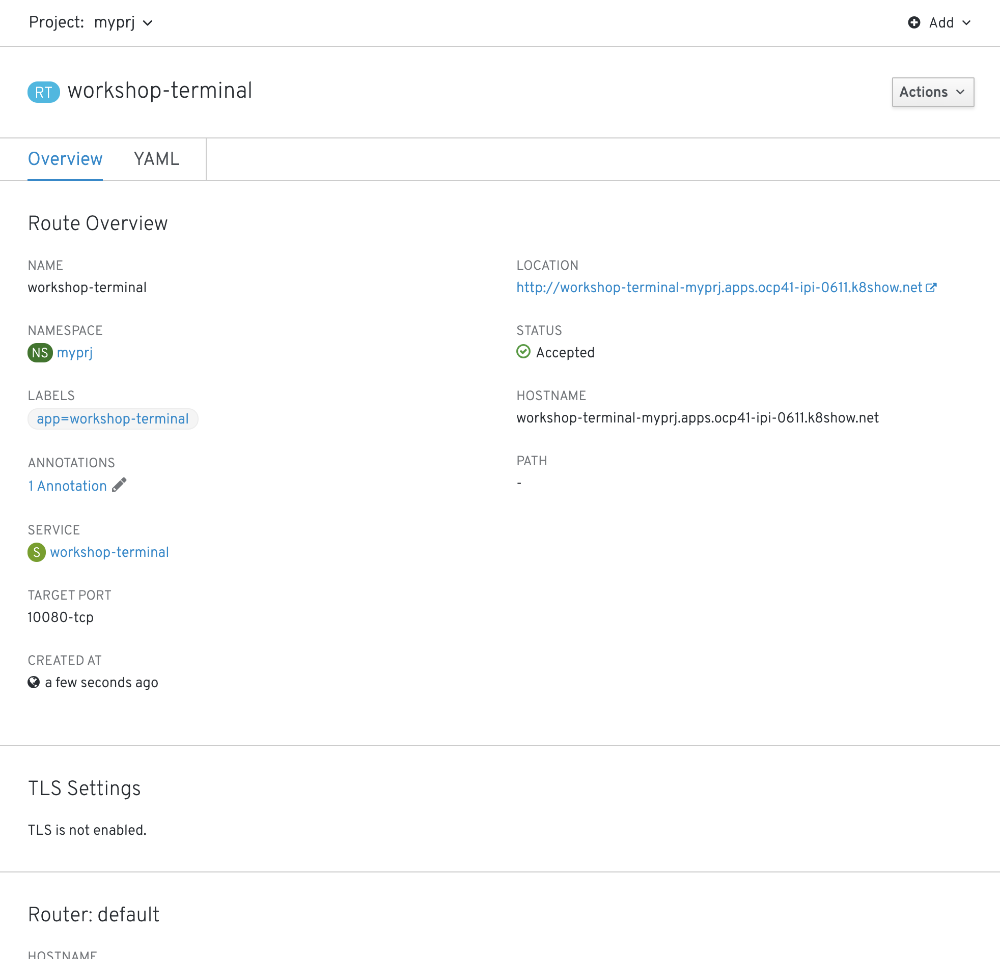

1. Terminalアプリが表示されることを確認します

    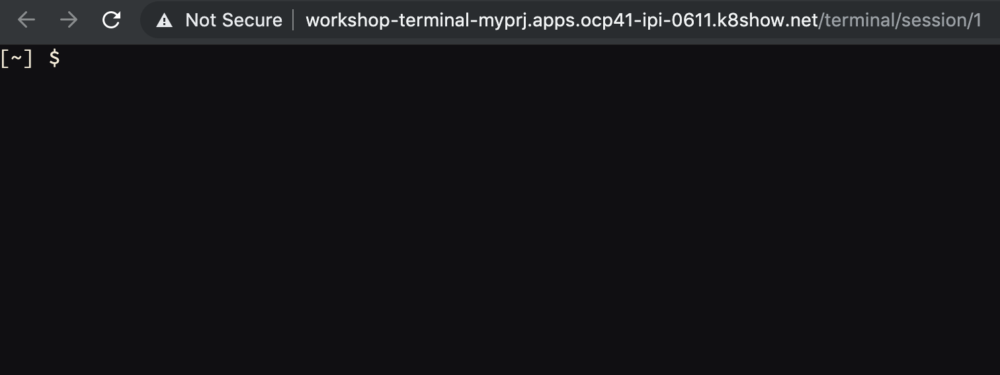

# [Trial works] - OCP上にアプリをデプロイ2
お題: 

「**workshop-terminalアプリの特定バージョン(2.10.2)を新規にデプロイして，Routerの振り先を変更してみよう**」

ヒント:

```
- 既存Project名(Namespace): <yourID>
- ContainerImage: quay.io/openshiftlabs/workshop-terminal:2.10.2
- 新規デプロイ時に指定する名前: <yourID>-workshop-terminal
- Service名: <yourID>-workshop-terminal
  - Routeからの振り先Service
- Route名: workshop-terminal
  - 振り先を指定する
```

# Jenkinsベースのビルドパイプライン
自動化ツールとして有名なOSSのJenkinsを使ってビルドパイプラインを作成してみましょう。

実際に手を動かす手順は以下です。
- JenkinsコンテナをOCP上で動作させる
- Jenkinsにパイプライン設定を入れる

今回はCLI操作をメインに使用して進めてみましょう。

1. 自身用の新規プロジェクトを作成します  **(例: user01a-jenkins)**

    ```
    $ oc project user01a-jenkins (<== ご自身のプロジェクト名)
    $ oc project
    Using project "user01a-jenkins" on server XXXXXXX
    
    上記のように出力確認できればOKです
    ```

1. Jenkinsテンプレートを使用してJenkinsのインスタンスをデプロイします

    ```
    $ oc get templates -n openshift
    $ oc get templates -n openshift | grep jenkins

    jenkins-ephemeral: 永続化なし <== 今回はこちらを使用
    jenkins-persistent: 永続化あり

    $ oc new-app jenkins-ephemeral -n user01a-jenkins  # -n 作成したプロジェクト名
    $ oc get pods
    $ oc project
    ```

1. Jenkinsにパイプライン設定(nodejs-sample-pipeline)を入れます

    ```
    $ oc create -f https://raw.githubusercontent.com/openshift/origin/master/examples/jenkins/pipeline/nodejs-sample-pipeline.yaml
    
    $ oc get buildconfigs
    nodejs-sample-pipeline  # oc createで作成されたPipeline
    
    $ oc get buildconfig/nodejs-sample-pipeline -o yaml　# 中身を確認

1. パイプラインを使用してビルドします

    ```
    $ oc start-build nodejs-sample-pipeline
    ```

1. JenkinsのUIに接続してパイプラインの進捗状況を確認します

    ```
    $ oc get route
    出力結果のLocation情報をコピーしてブラウザで確認します
    ```
    
    OCPのログイン情報を使用してJenkinsのUIにログインします
    
    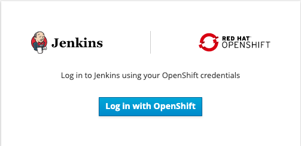
    
    htpasswdを選択し，その後ログイン情報を入力します(例: user01a, ocpuser)
    
    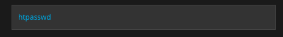
    
    **自身のプロジェクト名** を選択します(例: user01a-jenkins)
    
    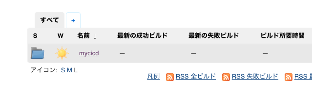

    **プロジェクト名/パイプライン名** を選択します (例: user01a-jenkins/nodejs-sample-pipeline)
    
    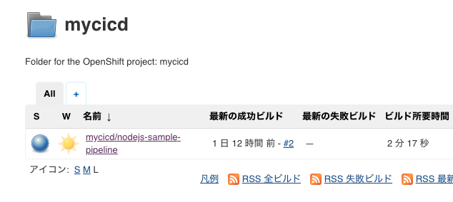

    時間経過とともにパイプラインのステージがだんだん右側に伸びていくことが確認できます

    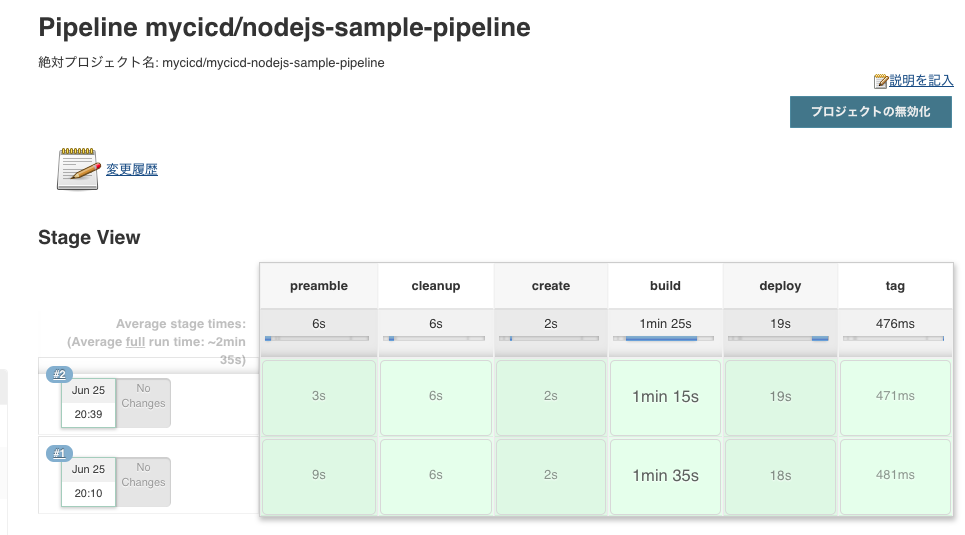

    ※パイプラインのステージの書き方は，前述の `oc get buildconfig/nodejs-sample-pipeline -o yaml`で確認できます

>Tips:
>
>ちなみに，Lab1ではOCPコンソール上でGUI操作で上記と同様の作業を行っていました。
>具体的には，**カタログ(Developer Catalog)** からPythonテンプレートを選択して，ソースコードとbuilder image(Python)を合体させることでコンテナイメージを作成し，デプロイしていました。
>
>また，OCPではJenkinsに限らず，ランタイムや他ミドルウェア，ソフトウェアなど多数のテンプレートを用意しています。自身(自社)でよく使うテンプレートを自作してカタログ上に追加することも可能です。その場合は，S2Iスクリプトを書く必要があります。
