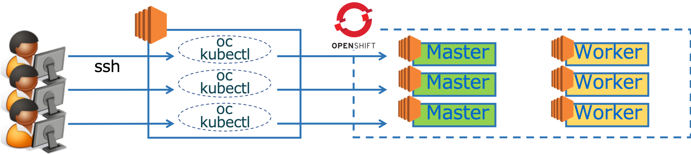

# ハンズオン概要
本ハンズオンは，OpenShift4(以降，OCPまたはOCP4)の基礎編です。  
インフラ向け応用編(Operator他)および開発向け応用編(CodeReady他)のワークショップも不定期開催しています。

OCP4基礎編では以下を学びます。
- OCP4クラスターの構築 (本日は実施しません。クラスターは構築済です。)
- OCP4コンソールツアー
- コンテナイメージのビルドとデプロイ
- Jenkinsベースのビルドパイプラインの使用

### Lab1: [OCP4クラスター構築，コンテナイメージのビルド&デプロイ](Lab1)
### Lab2: [Jenkinsベースのビルドパイプラインの使用，その他](Lab2)

# ハンズオン環境
本ハンズオンは，Kubernetesクラスター(OpenShift)の動作環境としてAWSを使用します。今回は構築済です。  

OCPクラスターに対するCLI操作をを行う際は，クライアントPCから，踏み台サーバー(Bastion Server)にSSH接続し，**ocコマンド** を使って制御します。  
`クライントPC <--SSH--> 踏み台サーバー <--oc--> OpenShift クラスター`

GUI操作は，クライアントPCのブラウザ(**Chrome/Firefox推奨**)を使用します。  

# 前提
以下の準備および確認を事前に済ませておいてください。
- SSH用ツール (EC2への接続する際に使用します)
- ブラウザ (Google Chrome or Firefox)
- ブラウザでの接続テスト
  - 下記リンクにブラウザからアクセスし，メモ帳アプリに正常アクセスできるか確認してください。
  - xxxxxx
  - **接続できない環境の場合はハンズオンを実施できない場合があります (サポートが必要な場合は担当者まで連絡ください)**
- Red Hat Customer Portalアカウントの登録(無償) ==> https://cloud.redhat.com/

# 注意事項
OCPクラスター接続情報など当日の連絡事項 (Etherpad) ==> 当日ご案内します

# タイムテーブル
Red Hat OpenShift Container Platform 4 ワークショップ

|Time|Agenda|Content|
|:---:|:---|:---|
|13:00-13:30|受付||
|(30min)|<講義> OCP4概要 と ハンズオン環境への接続|OCP4の特徴紹介||
|(60min)|<ハンズオン> Lab1  |OCP4インストール手順の確認 OCP4コンソールツアー コンテナイメージのビルド&デプロイ|
|(15min)|Break||
|(30min)|<講義> OCP4でのアプリケーションデプロイ概要|S2I (Source to Image)   CI/CD|
|(45min)|<ハンズオン> Lab2  |Jenkinsベースのビルドパイプライン その他コンテンツ|
|(-17:00)|アンケート記入，QA，フリーディスカッションタイム||
